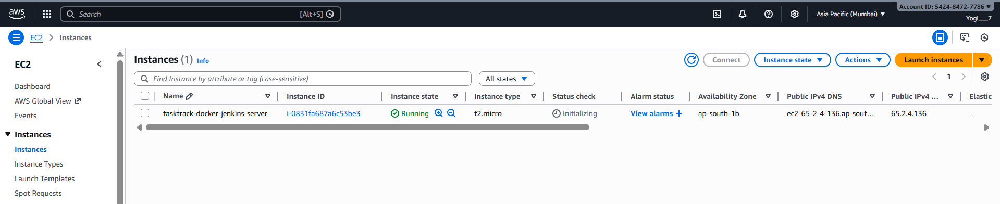
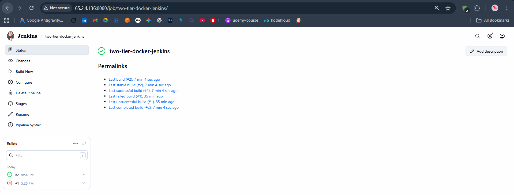
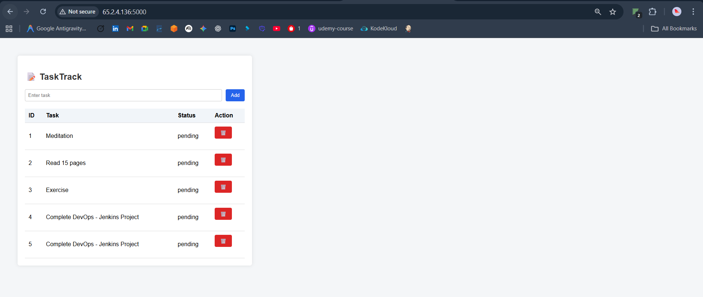

# 🚀 Production-Grade CI/CD Pipeline for a Two-Tier Web Application

> An end-to-end, containerized CI/CD pipeline built using Jenkins, Docker, and AWS EC2, demonstrating real-world DevOps practices.

---

## 📌 Project Summary

This project showcases a production-style CI/CD pipeline that automates the build and deployment of a two-tier Flask + PostgreSQL web application on AWS EC2 (Ubuntu).

It mirrors real DevOps workflows used in industry, including:
- Source-controlled Jenkins pipeline
- Containerized application architecture
- Automated build and deployment
- Cloud-hosted CI/CD infrastructure

---

## 🏗️ System Architecture



Developer → GitHub → Jenkins → Docker → AWS EC2 → Users

### 🔹 High-Level CI/CD Architecture (ASCII Diagram)

```text
+----------------------+
|     Developer        |
|  (Local Machine)     |
+----------+-----------+
           |
           |  Git Push
           v
+----------------------+
|    GitHub Repository |
|   (Source Control)   |
+----------+-----------+
           |
           |  Webhook / Poll SCM
           v
+------------------------------+
|          Jenkins             |
|     CI/CD Pipeline Server    |
+----------+-------------------+
           |
           |  Build & Deploy
           v
+------------------------------+
|        Docker Engine         |
|   Docker & Docker Compose    |
+----------+-------------------+
           |
           v
+------------------------------+
|      AWS EC2 (Ubuntu)        |
|                              |
|  +------------------------+  |
|  |  Flask App Container   |  |
|  |  Exposed on :5000      |  |
|  +------------------------+  |
|               |              |
|  +------------------------+  |
|  | PostgreSQL DB Container|  |
|  |   Exposed on :5432     |  |
|  +------------------------+  |
+--------------+---------------+
               |
               v
        End Users (Browser)

---

## 🧩 Technology Stack

- Jenkins
- Docker & Docker Compose
- Flask (Python)
- PostgreSQL
- AWS EC2 (Ubuntu 22.04)
- Git & GitHub

---

## 🔁 CI/CD Pipeline Workflow



1. Code pushed to GitHub
2. Jenkins pulls latest code
3. Docker image built
4. Docker Compose deploys containers
5. Application goes live

---

## 🐳 Running Containers


---

## 🌐 Application UI



App URL:
http://<EC2_PUBLIC_IP>:5000

Health:
http://<EC2_PUBLIC_IP>:5000/health

---

## 🎯 Resume Description

Designed and implemented a production-grade CI/CD pipeline using Jenkins and Docker to deploy a Flask + PostgreSQL application on AWS EC2, enabling automated builds and deployments.

---

## 👤 Author

Yogeshkumar Jagtap  
GitHub: https://github.com/yogeshkumarj7
